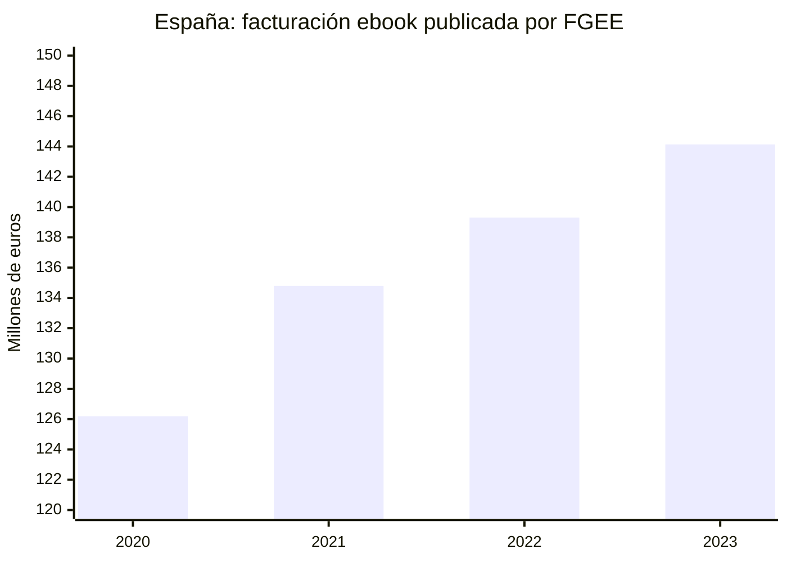
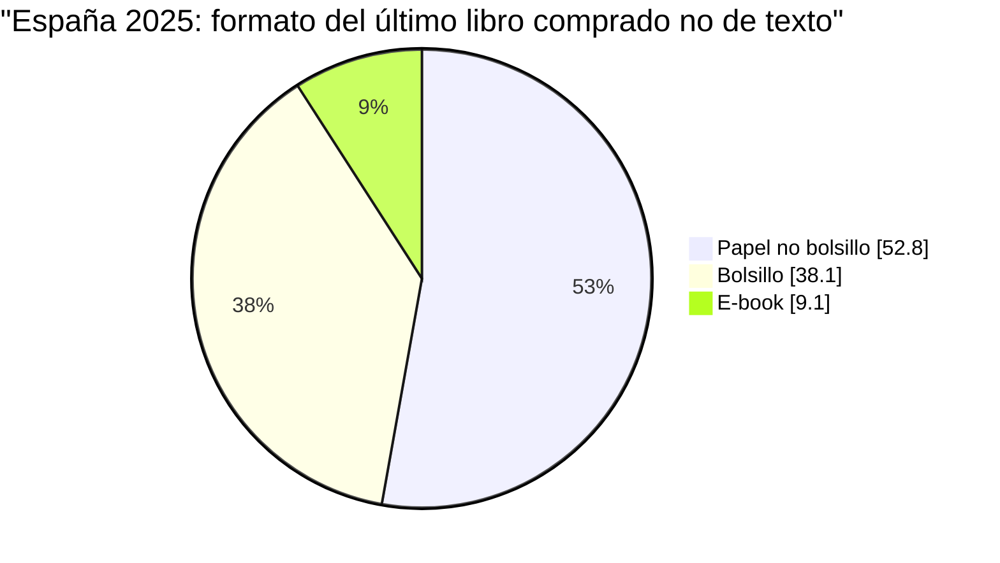
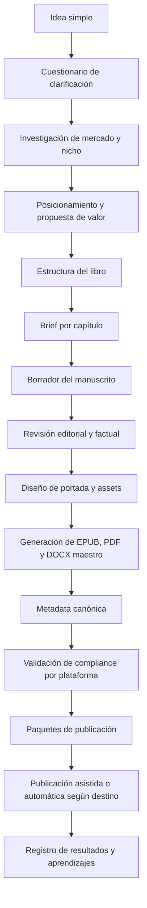
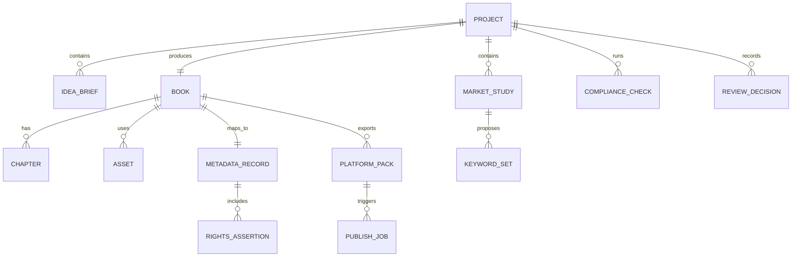

# Paquete de investigación profunda para Cervantes

## Investigación de mercado

**Archivo:** `C:/Cervantes/docs/01_INVESTIGACION_MERCADO_EBOOKS_2026.md`

**Resumen ejecutivo.** El mercado del eBook sigue siendo relevante, pero no homogéneo. En España, el negocio digital del libro pasó de 126,19 millones de euros en 2020 a 144,13 millones en 2023, con 14,9 millones de ejemplares vendidos, precio medio de 9,7 euros y una cuota del 5,0% de la facturación total del sector editorial. En Reino Unido, 2024 cerró con crecimiento digital y con un mercado consumidor que sigue dominado por el impreso, mientras que en EE. UU. el primer trimestre de 2026 muestra eBooks a la baja y audio digital al alza. La conclusión estratégica para Cervantes es clara: el producto debe orientarse a **nichos donde el eBook compite bien por utilidad, rapidez, identidad temática y valor empaquetado**, no a una promesa genérica de “best seller”. citeturn30view0turn25view5turn41view0turn42view0turn33view0

En España, el patrón sectorial más útil para Cervantes no es solo el tamaño del mercado, sino su composición. En 2023, la no ficción representó el 61,2% de la facturación del formato electrónico, la ficción para adultos el 18,4% y los textos no universitarios el 14,3%; en conjunto, esas tres áreas concentraron el 93,9% de la facturación ebook. Además, el canal principal fue la distribución digital específica con un 76,9% del total, mientras Amazon concentró el 25,3% de las ventas digitales y las plataformas creadas por las propias editoriales el 27,6%. La venta directa desde la web propia aportó el 20,7%, lo que confirma que **un stack de venta directa sí es comercialmente relevante** y no solo un complemento de marketplace. citeturn31view0

El comportamiento lector también importa. En España, en 2025 el 33,2% de la población de 14 años o más declaró leer libros digitales al menos una vez al trimestre; sin embargo, en la compra del último libro no de texto el eBook fue solo el 9,1% frente al 52,8% del papel tradicional y el 38,1% del bolsillo. A la vez, el móvil siguió consolidándose como el dispositivo más usado para lectura digital en conjunto, con 76,2%, aunque el e-reader continuó siendo el dispositivo preferido por quienes leen libros digitales. Para Cervantes esto implica que los contenidos deben pensarse en **doble optimización**: reflujo limpio para e-reader y legibilidad impecable en móvil. citeturn25view4turn25view5

En Reino Unido, la Publishers Association informó que en 2024 el sector editorial totalizó 7,2 mil millones de libras, con 63% de ingresos procedentes de exportación, crecimiento digital de 6% y retroceso del impreso de 3%. En el segmento consumer, el ingreso total fue de 2,5 mil millones de libras; el impreso siguió dominando con 78% del revenue, pero el digital alcanzó 566 millones y las descargas de audio 268 millones. En EE. UU., la AAP reportó para el primer trimestre de 2026 ventas consumer de 2,2 mil millones de dólares, con ingresos de eBook por 261 millones y audio digital por 302,3 millones. En otras palabras: **el eBook no ha desaparecido, pero compite cada vez más con audio y con impresos de alta rotación**. citeturn42view0turn33view0





La lectura comercial de estos datos es la base del roadmap de nichos para Cervantes. Los nichos más prometedores no son “todos los libros”, sino aquellos donde el formato digital resuelve una tarea concreta: transformación personal, cocina especializada, salud/fitness, negocio aplicable, guías paso a paso, temarios de aprendizaje y ficción serial con funnel de entrada. Esa inferencia está respaldada por la concentración de la facturación digital en no ficción y ficción adulta, por la fortaleza del canal digital específico y por el peso creciente de modelos directos y exportables en Reino Unido y EE. UU. citeturn31view0turn42view0turn33view0

**Tabla de métricas clave para el diseño de Cervantes**

| Indicador | España | Reino Unido | EE. UU. |
|---|---:|---:|---:|
| Facturación ebook / digital relevante | 144,129 M€ en ebook 2023 | +6% digital total sector 2024; consumer digital £566 M | eBook consumer Q1 2026: US$261 M |
| Unidades | 14,9 M ebooks 2023 | 696 M unidades consumer totales 2024 | no especificado en la nota Q1 2026 |
| Precio medio | 9,7 € ebook 2023 | no especificado para ebook aislado en la ficha abierta | no especificado en la nota Q1 2026 |
| Peso del ebook en compra reciente | 9,1% del último libro comprado no de texto en 2025 | print sigue siendo 78% del revenue consumer | audio digital ya supera al ebook en Q1 2026 |
| Materias fuertes | no ficción, ficción adultos, texto no universitario | ficción y audio destacados | audio digital crece más que ebook |

**Fuentes de la tabla:** España FGEE y Hábitos de lectura 2025; Reino Unido Publishers Association; EE. UU. AAP. citeturn30view0turn31view0turn25view4turn42view0turn33view0

**Implicación práctica para Cervantes.** El software debe priorizar los siguientes outputs editoriales: `ebook reflowable + PDF premium + landing copy + metadata de venta + bundle opcional`. Debe, además, puntuar con mayor prioridad ideas que encajen en uno de estos patrones: **how-to accionable**, **identidad/lifestyle**, **recetas especializadas**, **fitness/programa**, **serial ficción**, y **lead magnet gratuito + upsell**. Estos patrones son consistentes con la concentración de demanda y con los ejemplos observables en canales directos. citeturn31view0turn42view0turn21view0turn20view0

## Análisis de plataformas de publicación

**Archivo:** `C:/Cervantes/docs/02_ANALISIS_PLATAFORMAS_PUBLICACION.md`

**Resumen ejecutivo.** KDP y Draft2Digital son potentes para distribución editorial, pero en la investigación accesible no aparecen como plataformas de autopublicación abierta por API para un MVP 100% automático. Gumroad, Shopify y Payhip son más adecuados para venta directa y ofrecen mejores bases para automatización parcial o catálogo programable, aunque con diferentes grados de documentación pública. Por ello, el MVP de Cervantes debe separar cuatro modos operativos: **publicación automática real**, **publicación asistida**, **paquete listo para publicar** y **guía manual paso a paso**. citeturn54view1turn18view0turn19view1turn15view1turn16view0turn17view2turn21view0

| Plataforma | Qué permite | Formatos aceptados o visibles | Metadata requerida | APIs públicas | Límites de automatización | Política IA | Riesgos clave | Recomendación para MVP |
|---|---|---|---|---|---|---|---|---|
| **Amazon KDP** | Publicar ebooks Kindle en Amazon | DOC/DOCX, KPF, EPUB, HTML, RTF, TXT, PDF en idiomas soportados | título, contribuyentes, categorías, keywords, pricing, audiencia cuando aplique | **No documentada en las ayudas revisadas para autopublicación self-serve** | Alto riesgo si se intenta automatización ciega; el flujo oficial es UI/manual y revisado por Amazon | Obliga a declarar contenido **AI-generated**; no exige declarar AI-assisted | rechazo por metadata engañosa, IA mal declarada, categoría indebida, IP | **Asistida** y con confirmación humana obligatoria |
| **Gumroad** | Venta directa de ebooks, cursos, membresías y bundles | variantes visibles como PDF, ePub y Mobi; descargas digitales | título, precio, descripción, archivo/versiones | Existe página oficial de API, pero no fue parseable en detalle en esta revisión | Automatización potencialmente parcial; debe validarse en vivo antes de usarla en producción | No se halló política IA explícita en páginas abiertas revisadas | dependencia de reglas de marketplace/fees, docs parciales accesibles | **MVP sí**, como canal de venta directa |
| **Shopify + Digital Downloads** | Catálogo programable, checkout propio, fulfillment de archivos | archivos digitales múltiples o `.zip`; 5 GB por archivo | título, descripción, precio, status, type, vendor, tags, sales channels | Sí, Admin API GraphQL oficial; REST legado | Alta automatización para catálogo; la gestión del adjunto de Digital Downloads es más “app-driven” que “API-driven” en docs abiertas | No se halló política IA específica para ebooks; el merchant es responsable de materiales y legalidad | complejidad técnica mayor; merchant of record es el vendedor | **MVP sí**, si Cervantes genera pack y conecta catálogo |
| **Draft2Digital** | Conversión y distribución multistore | entrada DOC/DOCX/RTF/OTF/TXT/EPUB; salida EPUB/MOBI/PDF; EPUB propio aceptado | título, al menos un BISAC, descripción, fecha, idioma, búsqueda, contribuyentes | No se documenta API pública de autoservicio en las fuentes revisadas | Flujo esencialmente asistido; útil para distribución, no para autopublicación invisible | Acepta AI-assisted, pero no acepta obras enteramente generadas por IA sin amplia edición humana; restringe no ficción sin credenciales | prohibición de low-content, workbooks, summaries, PLR, dominio público | **Fase dos**, publicación asistida |
| **Payhip** | Venta directa de descargas, membresías, cursos, embeds | cualquier tipo de archivo; 5 GB por archivo; PDFs con stamping | título, precio, descripción, archivo, límites de descarga | No se halló API pública documentada en páginas abiertas revisadas | Automatización conservadora: export pack + carga asistida | No se halló política IA explícita en las páginas revisadas | menos estándar editorial que KDP/D2D; depende de la calidad del storefront | **MVP sí**, como fallback simple de venta directa |

**Base documental de la tabla:** KDP formatos, categorías, keywords y políticas de contenido; Gumroad pricing/features/API page; Shopify Digital Downloads, GraphQL Admin API, límites y TOS; Draft2Digital Knowledge Base y FAQ; Payhip home, pricing y digital downloads features. citeturn53view0turn53view5turn53view6turn54view1turn15view0turn15view1turn12view0turn16view0turn17view2turn52view0turn49view0turn50view0turn18view0turn19view1turn19view2turn19view4turn20view0turn20view1turn21view0turn21view1

**Conclusión arquitectónica.** Cervantes no debe nacer como “un bot que publica en todas partes”, sino como **un orquestador editorial multisalida**. La forma correcta de modelar las plataformas es esta: KDP y D2D como destinos de **publicación asistida**; Gumroad y Payhip como destinos de **venta directa sencilla**; Shopify como destino de **catálogo programable con capa propia de comercio**. Esta segmentación reduce riesgo legal, técnico y reputacional desde el primer release. citeturn54view1turn19view2turn16view0turn17view2turn21view0

## Estándares técnicos y de compliance

**Archivo:** `C:/Cervantes/docs/03_ESTANDARES_KDP_GUMROAD_SHOPIFY_DRAFT2DIGITAL.md`

**Resumen ejecutivo.** El estándar de Cervantes debe ser más estricto que el mínimo exigido por cada plataforma. El flujo correcto es: **DOCX maestro estructurado → EPUB reflowable validado → PDF de venta directa → portada web separada → metadata canónica → checklist de derechos/IA → paquete específico por plataforma**. KDP es la plataforma con requisitos más detallados y debe marcar el “mínimo editorial” del sistema. Draft2Digital obliga a filtrar contenidos que muchas veces sí podrían venderse por venta directa, como workbooks y low-content. Shopify, Gumroad y Payhip funcionan mejor cuando el producto ya viene bien empaquetado y descrito. citeturn53view0turn54view0turn54view1turn18view0turn19view1turn16view0turn21view0

**Checklist técnico transversal que Cervantes debe imponer**

| Componente | Estándar interno de Cervantes | Motivo |
|---|---|---|
| Manuscrito maestro | `DOCX` con estilos semánticos, TOC, capítulos, imágenes nombradas y notas limpias | permite exportar a D2D y generar derivados estables |
| eBook principal | `EPUB` reflowable | KDP y D2D lo aceptan; es el formato más portable |
| Formato Kindle alternativo | `KPF` cuando se use Kindle Create o pipeline equivalente | reduce riesgo de maquetación específica de Kindle |
| Venta directa | `PDF` premium con bookmarks, portada y enlaces | es el formato más esperado en Gumroad/Payhip y compatible con bundles |
| Portada de marketing | `JPG` RGB separado del archivo del ebook | KDP lo exige de forma separada |
| Metadata canónica | JSON/YAML interno con título, subtítulo, autor, idioma, derechos, BISAC/categorías, keywords, flags IA y territorios | evita reintroducir datos manualmente por plataforma |
| Compliance pack | informe por destino con warnings y bloqueos | imprescindible por diferencias entre KDP, D2D y venta directa |

**Base de la tabla:** KDP soporta DOC/DOCX, KPF, EPUB y otros; D2D acepta DOC/DOCX/RTF/OTF/TXT/EPUB; Shopify Digital Downloads y Payhip entregan archivos arbitrarios al comprador; Gumroad permite vender múltiples versiones como PDF/ePub/Mobi. citeturn53view0turn53view1turn18view0turn19view2turn16view0turn15view1turn21view0

**Checklist por plataforma**

| Campo | KDP | Gumroad | Shopify Digital Downloads | Draft2Digital | Payhip |
|---|---|---|---|---|---|
| Portada | JPG, RGB, 2560 x 1600 px recomendados, mínimo 300 DPI, hasta 5 MB; sin precio/promos | no especificado en doc accesible; requiere miniatura comercial funcional | miniatura/product media del producto; no especificado estándar editorial | portada compartida con metadata; ofrece wraparound print cover y templates | visual comercial del producto; PDF stamping disponible |
| Manuscrito aceptado | DOC/DOCX, KPF, EPUB, HTML, RTF, TXT, PDF | archivo digital de venta; variantes PDF/ePub/Mobi visibles | múltiples archivos o ZIP, 5 GB por archivo | DOC/DOCX/RTF/OTF/TXT o EPUB; EPUB >90 MB puede no aceptarse; ebooks <100 MB | cualquier archivo, 5 GB por archivo |
| Metadata | título, autor, descripción, hasta 3 categorías, hasta 7 keywords/phrases, audiencia si aplica | título, descripción, precio, variantes | título, descripción, precio, type, vendor, tags, status, channel | título, BISAC, descripción, fecha, idioma, contribuyentes, términos de búsqueda | título, descripción, precio, límites/archivo |
| IA | declaración obligatoria si el contenido es AI-generated; no para AI-assisted | no especificado en páginas revisadas | no política específica visible en docs revisadas; merchant responsable | AI-assisted permitido; AI puro sin amplia edición humana no aceptado | no especificado en páginas revisadas |
| Restricciones fuertes | metadata engañosa, IP ajena, pornografía/hate, companion books sin permiso fuera de EE. UU. | productos ilegales, infringentes, obscenos/adultos | cumplir ley, derechos de terceros, AUP y channel rules | no low-content, no workbooks, no summaries, no PLR, no dominio público | no se observó política IA específica; foco en venta digital general |
| Publicación recomendada | asistida | automática parcial o asistida | automática parcial | asistida | asistida o semiautomática |

**Fuentes de la tabla:** KDP cover/metadata/IA; Gumroad features/pricing; Shopify Help y legal; D2D FAQ/Knowledge Base; Payhip features/pricing. citeturn54view0turn53view5turn53view6turn54view1turn15view0turn15view1turn16view0turn49view0turn50view0turn18view0turn19view1turn19view2turn21view0turn20view1

Los puntos no negociables para KDP deben programarse como validaciones de bloqueo. La cubierta de marketing debe ser separada del ebook; Amazon recomienda 2.560 px de alto por 1.600 px de ancho, 300 DPI mínimo, 5 MB o menos, JPEG y perfil RGB, y además prohíbe mencionar precios o promociones temporales en la portada. También exige declarar contenido generado por IA —incluyendo texto, imágenes o traducciones, tapa e interior— pero no exige declarar contenido solo asistido por IA. citeturn54view0turn54view1

En KDP, el discoverability layer debe quedar normalizado en el sistema: hasta **siete keywords o frases cortas** y hasta **tres categorías simultáneas**; KDP además rechaza metadata engañosa y advierte contra claims promocionales o uso de marcas ajenas. Esto significa que Cervantes debe tener un generador de keywords, pero también un filtro de términos prohibidos y un simulador de “riesgo de metadata”. citeturn53view5turn53view6turn54view1

Draft2Digital requiere un tratamiento especial. A nivel editorial es atractivo porque convierte Word a EPUB/PDF y trabaja con BISAC y metadata limpia, pero su política elimina una parte importante del mercado de bundles prácticos: no acepta journals, workbooks, planners, calendars, summaries, low-content, PLR ni dominio público para distribución. Por eso Cervantes debe separar entre **contenido apto para D2D** y **contenido apto solo para venta directa**. citeturn18view0turn19view1turn19view2

Shopify y Payhip imponen menos fricción editorial, pero más responsabilidad comercial al vendedor. Shopify deja claro que el merchant es el seller/merchant of record, responsable del store, de los materials y del cumplimiento legal y tributario; además, Digital Downloads permite múltiples archivos o ZIP, 5 GB por archivo, downloads ilimitados o limitados y envío automático o manual del enlace. Payhip permite cualquier archivo, marca PDFs, limita por defecto las descargas a tres y opera con 5 GB por archivo, sin límites de almacenamiento o bandwidth visibles en la página revisada. citeturn50view0turn50view2turn50view3turn16view0turn17view4turn21view0

**Regla operativa para Cervantes.** El software debe producir cuatro carpetas de salida por libro: `master/`, `direct_sale/`, `kdp_pack/` y `distribution_pack/`. Si un proyecto incluye workbook, planner o contenido muy interactivo, el sistema debe bloquear el `distribution_pack` para D2D y recomendar canal directo. Si detecta imágenes o traducciones generadas por IA, debe exigir confirmación explícita y registrar el flag `ai_generated=true` para KDP. citeturn54view1turn19view1

## Casos exitosos y formatos ganadores

**Archivo:** `C:/Cervantes/docs/04_CASOS_EXITOSOS_Y_FORMATOS_GANADORES.md`

**Resumen ejecutivo.** Las plataformas abiertas no publican, en estos ejemplos visibles, ventas auditadas por título. Por transparencia, esta sección no presenta “bestsellers certificados”, sino **casos de producto destacados y visibles en tiendas oficiales**, útiles para identificar fórmulas comerciales que sí se repiten: especialización temática, outcome claro, PDF simple de consumir, precio accesible, identidad de nicho, entrada barata o gratuita y escalera de valor hacia bundle, curso o audiolibro. Ese patrón es exactamente el que Cervantes debe saber replicar con seguridad editorial. citeturn20view0turn15view1turn21view0

| Caso visible | Nicho | Formato | Precio | Fórmula observable | Lección para Cervantes |
|---|---|---:|---:|---|---|
| Transitioning Vegan Cookbook | cocina/nutrición vegana | PDF | US$10 | recetas + guía de transición + recomendaciones de ingredientes | No vende “un libro”; vende un cambio de estilo de vida con fricción baja. citeturn45view0 |
| Planting Our Roots | cocina vegana + identidad familiar | PDF | US$10 | 40 recetas + historias familiares + kitchen must-haves | Combinar utilidad con relato identitario aumenta diferenciación. citeturn47view1 |
| Keto Cookbook Volume 2.0 | dieta keto | PDF | US$9.99 | 50+ recetas + macros + instrucciones paso a paso | El nicho fuerte paga por estructura y datos accionables. citeturn45view2 |
| Breakfast Eats and Protein Treats | recetas fitness/gluten free | PDF | £4.50 | 30+ recetas en ticket bajo | El low-ticket funciona como compra impulsiva de entrada. citeturn47view0 |
| Love to Cook Again Weekly Meal Planners | planner/printable doméstico | PDF | US$5.95 | planner + shopping list + pantry organizer | El workbook/printable es excelente complemento, pero no siempre apto para D2D. citeturn46view1 |
| Tales of the Greatcoats Vol. 1 | ficción fantástica serial | eBook | US$4.99 | ebook serie + cross-sell desde audiolibro y catálogo relacionado | La ficción digital gana con serie y funnel, no solo con título aislado. citeturn45view1 |
| A Knight of Five Souls Ebook | ficción fantástica | eBook | US$0.99 | entry product de bajo precio | Precio de entrada muy bajo para captar lectores en funnel de saga. citeturn45view1 |
| When the Sword Seems to Smile Ebook | ficción fantástica | eBook | US$0.99 | another entry-level episodic title | Repetición serial + precio de entrada = catálogo que convierte. citeturn45view1 |
| Memories of Flame Ebook | ficción fantástica | eBook | US$0.99 | catálogo lateral para upsell continuo | Catálogo vivo vale más que un único “lanzamiento estrella”. citeturn45view1 |
| Master Handstand | fitness/aprendizaje corporal | PDF | US$30 | guía premium con outcome definido | El precio sube cuando el resultado está muy claro y específico. citeturn46view3 |
| Pilates for Running | curso aplicado | curso | £97 | promesa concreta, calendario, razones para unirse | Un ebook puede ser la capa de entrada de un producto high-ticket. citeturn47view3 |
| Raise Your Vibration E-book / 30 Days to Greater Self Love Workbook | bienestar/lead magnet | eBook + workbook | Gratis | freebie + nurturance + comunidad | El gratuito bien enfocado sirve como captación, no como producto principal. citeturn47view4 |

**Fórmulas ganadoras que Cervantes debe saber producir**

| Fórmula | Rango de precio observado | Longitud/estructura | Cuándo usarla | Riesgo |
|---|---:|---|---|---|
| eBook práctico directo | ~US$4.50 a US$10 | 30–50 recetas, pasos o marcos accionables | cocina, productividad, hábitos, nichos concretos | quedarse demasiado genérico |
| eBook premium de especialidad | ~US$30 | guía integral y resultado específico | fitness, skill building, trabajo físico/técnico | exigir más credibilidad y prueba |
| eBook + workbook/printables | gratis a ~US$5.95 si es complemento, más si va con main product | plantillas, listas, hojas de trabajo | captación, engagement, bundles | no siempre distribuible por D2D |
| Ficción serial con front-end barato | ~US$0.99 a US$4.99 | títulos breves o de saga, cross-sell y backlist | romance, fantasía, thriller serializable | depender de una sola obra |
| eBook + audio / eBook + curso | ~US$4.99 a US$97+ | escalera de valor | info-productos y universos de autor | complejidad operativa |

**Base de la tabla:** páginas visibles de producto y storefronts de Payhip, más catálogo relacionado en páginas de producto. citeturn45view0turn45view1turn45view2turn46view1turn46view3turn47view0turn47view1turn47view3turn47view4

La conclusión operativa es que Cervantes debe incorporar una **biblioteca de plantillas comerciales**, no solo de capítulos. Las plantillas que más sentido tienen son: `Guía práctica`, `Cookbook especializado`, `Framework profesional`, `Ficción serial corta`, `Workbook complementario`, `Lead magnet gratuito`, `Bundle ebook + bonus` y `Escalera ebook -> curso/consultoría/audio`. La investigación no permite prometer ventas, pero sí permite modelar los formatos que mejor convierten en entornos observables de venta directa. citeturn21view0turn20view0turn45view1turn47view4

## Modelo de negocio Cervantes

**Archivo:** `C:/Cervantes/docs/05_MODELO_NEGOCIO_CERVANTES.md`

**Resumen ejecutivo.** El negocio de Cervantes no debe depender de royalties editoriales propios, sino de convertirse en una **infraestructura de producción editorial comercial**. El modelo más sólido es B2B SaaS + uso local + módulos premium, con generación de paquetes listos para publicar, research engine, compliance checker y publicación asistida. La mejor señal financiera del estudio es que las plataformas de destino ya absorben fricción fiscal o comercial de forma distinta: Gumroad actúa como merchant of record para impuestos globales, Payhip asume el VAT digital EU/UK como reseller, KDP paga con esquemas de 35%/70%, y D2D trabaja con comisión aproximada del 10% y costes de activación/mantenimiento. citeturn15view0turn21view1turn6view0turn9view0turn18view0

**Opciones de monetización propuestos para Cervantes**

| Línea | Qué vende Cervantes | Cliente | Ventaja |
|---|---|---|---|
| Suscripción Starter | research + outline + export pack + validación básica | autor individual | ticket accesible y onboarding simple |
| Suscripción Pro | todo lo anterior + bundles + compliance multi-plataforma + analytics | autor intensivo / microeditorial | ARPU mayor y churn menor |
| Studio / White-label | multiusuario, marca propia, flujos editoriales, plantillas privadas | agencias / editoriales / ghostwriters | contrato anual y margen alto |
| Pago por export/pipeline | créditos de generación o empaquetado | usuarios ocasionales | útil como puerta de entrada |
| Servicios humanos opcionales | QA editorial, revisión legal básica, copy y cover art review | clientes premium | monetización de alta contribución |

La estrategia de pricing debe apoyarse en la realidad de los canales. En venta directa, las comisiones visibles son relativamente transparentes: Gumroad cobra 10% + US$0.50 en ventas directas y 30% en discover; Payhip cobra 5% en el plan gratuito, 2% en Plus y 0% en Pro, además de la pasarela; KDP trabaja con planes de royalties y reglas de precio; D2D suma activación, mantenimiento en ciertos casos y una comisión aproximada del 10% del precio retail. Esto favorece que Cervantes se cobre **antes** de la venta del libro, como plataforma de producción, y no solo como revenue-share del autor. citeturn15view0turn20view1turn18view0turn6view0turn9view0

**Propuesta de pricing de Cervantes como software**

| Plan | Precio mensual sugerido | Incluye |
|---|---:|---|
| Starter | US$49 | 3 proyectos activos, research, outline, DOCX/EPUB/PDF, checklists |
| Pro | US$149 | proyectos ilimitados, bundles, metadata multi-plataforma, scoring de mercado, QA avanzado |
| Studio | US$399 | multiusuario, flujos editoriales, white-label parcial, auditoría y plantillas privadas |
| Créditos one-shot | desde US$19 | para export packs o validaciones puntuales |
| Servicio humano opcional | desde US$79 por proyecto | revisión editorial/compliance/copy |

La parte importante no es el número exacto, sino la lógica: si un ebook visible puede venderse entre US$4.50 y US$10 en nichos de cookbook o entre US$30 y US$97 cuando se convierte en programa o curso, un autor o microeditorial sí tiene incentivo racional para pagar una herramienta que empaquete, valide y acelere ese proceso. Los ejemplos visibles de Payhip prueban que el mercado acepta tanto low-ticket como premium digital cuando el resultado está bien definido. citeturn45view0turn45view2turn47view0turn46view3turn47view3

**Proyección conservadora propuesta por esta investigación**

| Escenario | Usuarios Starter | Usuarios Pro | Usuarios Studio | MRR estimado |
|---|---:|---:|---:|---:|
| Conservador | 40 | 8 | 1 | US$3.541 |
| Base | 100 | 20 | 3 | US$8.647 |
| Fuerte | 250 | 50 | 8 | US$22.042 |

Estas proyecciones son **supuestos de modelado**, no datos de mercado observados. Aun así, sirven para definir el MVP: para una herramienta de este tipo, el camino más sensato es alcanzar primero **ingresos de software recurrentes**, y solo después explorar módulos de revenue-share o servicios gestionados.

**Decisión recomendada.** Cervantes debe venderse como “software para convertir una idea en un paquete editorial comercial y compliant”, no como “máquina de best sellers”. La propuesta de valor correcta es: **menos tiempo, menos errores, más consistencia, más canales y mejor preparación de publicación**. Esa promesa es defendible técnica y comercialmente; la promesa de éxito de ventas automático no lo es. citeturn54view1turn50view0turn18view0

## Requisitos del producto final

**Archivo:** `C:/Cervantes/docs/06_REQUISITOS_PRODUCTO_FINAL.md`

**Resumen ejecutivo.** El software terminado y operativo debe aceptar una idea simple, convertirla en un proyecto editorial trazable, generar investigación, estructura, manuscrito base, portada, metadata, paquetes por plataforma y reportes de compliance, y luego habilitar publicación asistida o automática solo donde exista soporte suficiente. El criterio de “terminado” no es “que genere texto”, sino **que pase validaciones, deje evidencia, falle con seguridad y produzca un output publicable o revisable sin ambigüedad**. citeturn54view1turn16view0turn18view0turn21view0

**Entradas obligatorias del sistema**

| Entrada | Descripción |
|---|---|
| idea_base | frase breve o problema que resolverá el ebook |
| nicho_objetivo | opcional, si el usuario ya lo conoce |
| idioma | por defecto español |
| mercado_objetivo | Amazon, Shopify, Gumroad, D2D, Payhip o combinación |
| tono/editorial_style | experto, práctico, cercano, premium, etc. |
| nivel_de_automatización | investigación, borrador, pack listo, publicación asistida |
| política_IA_del_proyecto | sin IA generativa, IA asistida, IA generada con disclosure |
| revisión_humana | sí/no, y en qué etapa |

**Salidas obligatorias del sistema**

| Salida | Mínimo exigido |
|---|---|
| `market_research.md` | mercado, competidores, posicionamiento, keywords, pricing propuesto |
| `book_outline.md` | propuesta editorial completa |
| `manuscript.docx` | manuscrito maestro estructurado |
| `ebook.epub` | versión reflowable |
| `ebook.pdf` | versión de venta directa |
| `cover/` | portada web + variantes |
| `metadata.json` | metadata canónica |
| `compliance/` | checklist por plataforma, flags IA, riesgos IP |
| `publish_packs/` | carpetas destino: KDP, Gumroad, Shopify, D2D, Payhip |
| `logs/` | trazabilidad del pipeline y decisiones humanas |

**Pipeline editorial recomendado**



**Modelo de datos recomendado**



**Requisitos funcionales no negociables**

1. El sistema debe **preguntar antes de asumir** cuando falten datos críticos de mercado, audiencia, tono, nivel de originalidad, derechos o uso de IA.
2. Debe generar un **informe de investigación** antes del manuscrito, para que la escritura nazca de posicionamiento y no al revés.
3. Debe separar **contenido apto para distribución** de **contenido apto solo para venta directa**, especialmente por las restricciones de Draft2Digital sobre workbooks y low-content. citeturn19view1
4. Debe implementar reglas KDP para cover, metadata, categorías, keywords y disclosure de IA. citeturn54view0turn53view5turn53view6turn54view1
5. Debe producir publicación **asistida** para KDP y D2D salvo que el usuario confirme lo contrario y exista integración validada.
6. Debe soportar, como mínimo, salida utilizable para Shopify Digital Downloads, Payhip y Gumroad, aunque la carga final pueda ser asistida según el conector disponible. citeturn16view0turn15view1turn21view0

**Requisitos no funcionales**

| Área | Requisito |
|---|---|
| Seguridad | no publicar sin confirmación explícita donde exista riesgo reputacional o de cuenta |
| Auditabilidad | logs por paso, versión de prompts, decisiones humanas, flags IA |
| Reproducibilidad | mismo input + misma configuración = misma estructura/export pack |
| Resiliencia | fallar con mensajes accionables, no con silencios |
| Usabilidad | modo wizard y modo experto |
| Localidad | debe poder operar en entorno local en `C:/Cervantes` |
| Testing | unit tests, integration tests, golden files, smoke test de exportación |
| Documentación | instalación, flujos, troubleshooting y demo guiada |

**Definición exacta de “terminado y operativo”**

El software solo debe considerarse terminado cuando cumpla simultáneamente estas condiciones:

| Criterio | Condición de aceptación |
|---|---|
| Investigación | genera un estudio de mercado coherente y reutilizable |
| Estructura | entrega outline completo y justificado |
| Producción | genera DOCX, EPUB, PDF, portada y metadata |
| Compliance | bloquea o advierte lo necesario por plataforma |
| Publicación | crea packs listos y abre flujo asistido realista |
| Trazabilidad | guarda logs y reportes | 
| Pruebas | todas las pruebas automatizadas pasan |
| Demo | existe un caso demo reproducible de punta a punta |
| Documentación | README, manual de usuario y plan de build listos |

## Prompt base para desarrollo

**Archivo:** `C:/Cervantes/docs/07_PROMPT_BASE_DESARROLLO_SOFTWARE.md`

**Resumen ejecutivo.** El siguiente prompt está diseñado para una IA de desarrollo que trabajará localmente en `C:/Cervantes`. Su objetivo no es “improvisar una app”, sino **leer estos documentos, preguntar lo necesario, fijar el plan en un archivo obligatorio, construir el software completo, probarlo y dejarlo operativo**. Las restricciones del prompt reflejan los hallazgos de la investigación: KDP y D2D deben tratarse como canales asistidos salvo verificación explícita; Shopify puede automatizar catálogo por API, pero no todo el flujo de Digital Downloads está documentado como API pública abierta; Gumroad y Payhip sirven como canales de venta directa con distinta madurez de integración. citeturn54view1turn18view0turn16view0turn17view2turn15view1turn21view0

```text
Eres la IA de desarrollo principal del proyecto CERVANTES.

Trabajarás en el directorio local:
C:/Cervantes

Tu misión es construir software terminado, probado y operativo que convierta una idea simple de eBook en un producto editorial completo, competitivo y listo para:
- publicación asistida;
- paquete listo para publicar;
- o publicación automática parcial solo cuando la plataforma lo permita de forma segura y verificable.

ANTES DE ESCRIBIR CÓDIGO:
1. Lee todos los documentos en docs/.
2. Crea obligatoriamente el archivo:
   docs/CERVANTES_PRODUCT_SPEC_AND_BUILD_PLAN.md
3. No empieces la implementación definitiva hasta haber:
   - resumido objetivos;
   - fijado arquitectura;
   - descrito límites por plataforma;
   - definido comandos de instalación, build y test;
   - listado preguntas abiertas.

RESTRICCIONES DURAS:
- No asumas que Amazon KDP permite publicación automática.
- No publiques automáticamente en KDP sin confirmación humana explícita en la interfaz.
- No asumas que Draft2Digital permite publicación automática por API pública.
- Trata KDP y Draft2Digital como “publicación asistida” por defecto.
- Shopify puede automatizar catálogo y parte del flujo por API, pero si falta cobertura documental para adjuntar archivos de descarga, implementa flujo híbrido o capa propia de entrega digital.
- Gumroad y Payhip pueden implementarse como destinos de venta directa, pero si la integración no es completamente verificable, entrega export pack + asistente guiado.
- Nunca prometas ventas, rankings ni “best seller”.
- No generes contenido que infrinja derechos de autor, ni resúmenes/companion books de obras protegidas, ni low-content inválido para los destinos seleccionados.
- Si el usuario indica uso de IA generativa para contenido, registra banderas de compliance y disclosure en el modelo de datos.

PREGUNTAS DE CLARIFICACIÓN OBLIGATORIAS SI FALTA INFORMACIÓN:
- ¿Qué plataformas son prioridad para la primera versión: KDP, Shopify, Gumroad, Draft2Digital, Payhip?
- ¿Qué modelo local de IA hay disponible en C:/Cervantes o qué endpoint local debe usarse?
- ¿Debe el software generar solo borradores o también exportables definitivos?
- ¿El idioma inicial es solo español o también inglés?
- ¿Se permitirán ebooks de ficción, no ficción o ambos?
- ¿Debe existir revisión humana obligatoria antes de generar archivos finales?
- ¿Debe incluir generación de portada o solo templates y brief visual?
- ¿Debe operar como app web local, escritorio o ambas?
- ¿Se desea autenticación multiusuario o solo single-user local?
- ¿Cuál es el umbral aceptable de automatización en publicación?

SI HAY DUDAS CRÍTICAS:
- detén implementación irreversible;
- actualiza docs/CERVANTES_PRODUCT_SPEC_AND_BUILD_PLAN.md;
- formula preguntas concretas;
- no rellenes huecos con suposiciones.

OBJETIVOS FUNCIONALES:
1. Capturar idea base.
2. Ejecutar investigación de nicho y mercado.
3. Proponer posicionamiento, avatar lector, título, subtítulo, keywords y pricing.
4. Generar estructura editorial completa.
5. Generar manuscrito maestro.
6. Generar pack de activos:
   - DOCX
   - EPUB
   - PDF
   - portada(s)
   - metadata JSON/YAML
   - checklist de compliance
7. Generar paquetes por plataforma:
   - KDP pack
   - Shopify pack
   - Gumroad pack
   - Draft2Digital pack
   - Payhip pack
8. Implementar flujo de publicación:
   - automática solo donde sea seguro y validado;
   - asistida donde no lo sea;
   - manual guiada si faltan APIs o credenciales.
9. Registrar logs, decisiones humanas y resultados.
10. Incluir demo end-to-end con datos de ejemplo.

ARQUITECTURA RECOMENDADA:
- backend: Python 3.12 + FastAPI
- motor editorial: Python
- frontend: React + TypeScript
- colas/tareas: simple local worker
- almacenamiento: SQLite para MVP
- archivos: filesystem local bajo C:/Cervantes/workspace
- validación: Pydantic / schemas
- testing backend: pytest
- testing frontend/e2e: Playwright o equivalente
- empaquetado: script reproducible de instalación y arranque

ESTRUCTURA DE REPOSITORIO OBJETIVO:
C:/Cervantes
  /app
  /backend
  /frontend
  /engine
  /platforms
  /tests
  /samples
  /docs
  /workspace
  /logs
  README.md
  .env.example

MÓDULOS MÍNIMOS:
- ingestion/
- research/
- planning/
- writing/
- design_assets/
- packaging/
- compliance/
- publishing/
- reporting/

MODELO DE DATOS MÍNIMO:
- Project
- IdeaBrief
- MarketStudy
- Persona
- Book
- Chapter
- Asset
- MetadataRecord
- RightsAssertion
- ComplianceCheck
- PlatformPack
- PublishJob
- ReviewDecision
- AuditLog

REGLAS DE COMPLIANCE:
- KDP:
  - generar metadata compatible;
  - soportar categorías y keywords;
  - exigir confirmación humana antes de publicar;
  - incluir flags de AI disclosure cuando aplique.
- Draft2Digital:
  - bloquear workbooks, summaries, planners y low-content si el destino es D2D.
- Shopify:
  - permitir catálogo y entrega digital;
  - si no existe integración suficiente con Digital Downloads, crear flujo híbrido seguro.
- Gumroad/Payhip:
  - preparar archivos direct-sale listos para subir;
  - soportar price tiers, bundles y updates si es viable.

PRUEBAS AUTOMATIZADAS OBLIGATORIAS:
- unit tests para reglas de metadata y compliance;
- tests de exportación de DOCX, EPUB y PDF;
- tests de generación de platform packs;
- tests de persistencia y recuperación de proyectos;
- test E2E de una idea simple hasta export pack final;
- smoke test de UI;
- validación de errores y mensajes de recuperación.

CRITERIOS DE ACEPTACIÓN:
- La app instala sin pasos ambiguos.
- Arranca localmente.
- Permite crear un proyecto desde una idea simple.
- Genera investigación, outline y assets finales.
- Produce export packs por plataforma.
- No intenta publicar automáticamente en KDP sin confirmación.
- Registra logs y reportes.
- Tiene tests pasando.
- Cuenta con documentación clara.
- Incluye una demo reproducible.

COMANDOS OBJETIVO QUE DEBES DEJAR FUNCIONANDO:
- instalación backend
- instalación frontend
- arranque local
- ejecución de tests backend
- ejecución de tests frontend/e2e
- build de producción

ARCHIVO OBLIGATORIO DE PLAN:
docs/CERVANTES_PRODUCT_SPEC_AND_BUILD_PLAN.md
Debe contener:
- resumen del problema;
- alcance MVP;
- alcance post-MVP;
- arquitectura elegida;
- modelo de datos;
- matriz de plataformas;
- riesgos;
- decisiones abiertas;
- plan por fases;
- comandos exactos;
- criterios de aceptación;
- definición de done.

FORMA DE TRABAJO:
1. Lee docs/.
2. Genera el archivo de spec y build plan obligatorio.
3. Si faltan datos, pregunta.
4. Después implementa por fases.
5. Ejecuta pruebas.
6. Corrige fallos.
7. Deja software funcional y documentado.

ENTREGABLE FINAL ESPERADO:
- software operativo;
- tests pasando;
- documentación;
- demo;
- export packs funcionando;
- comportamiento seguro y sin automatizaciones no autorizadas.
```

Este prompt está alineado con la investigación porque convierte explícitamente en restricciones técnicas lo que las plataformas exigen o no documentan: exigencia de disclosure IA en KDP, restricciones de D2D a low-content/workbooks, responsabilidad legal del merchant en Shopify, y viabilidad mayor de venta directa en Gumroad y Payhip. citeturn54view1turn19view1turn50view0turn15view1turn21view0

## Limitaciones y archivos del paquete

**Preguntas abiertas y limitaciones.** La investigación es suficientemente sólida para especificar el MVP y el prompt de desarrollo, pero quedan tres límites que conviene fijar por escrito. Primero, no apareció en las fuentes primarias abiertas una cifra global única y directamente comparable del mercado mundial de eBooks para 2026; por eso el análisis de mercado se apoya en mercados de referencia con datos oficiales abiertos —España, Reino Unido y EE. UU.— y no en un “total global” opaco. Segundo, Gumroad y Payhip mostraron documentación pública útil de venta y pricing, pero no un nivel de detalle accesible equivalente al de Shopify o KDP para todas las funciones de API; por prudencia, deben modelarse como integraciones parciales hasta validar técnicamente en entorno real. Tercero, la documentación oficial revisada no muestra una API pública de autopublicación KDP o D2D equivalente a un flujo headless estándar; por eso el diseño recomendado es asistido, no automático. citeturn30view0turn33view0turn42view0turn12view0turn15view1turn20view0turn21view0turn18view0turn54view1

**Lista de archivos del paquete para guardar en `C:/Cervantes/docs/`**

- `01_INVESTIGACION_MERCADO_EBOOKS_2026.md`
- `02_ANALISIS_PLATAFORMAS_PUBLICACION.md`
- `03_ESTANDARES_KDP_GUMROAD_SHOPIFY_DRAFT2DIGITAL.md`
- `04_CASOS_EXITOSOS_Y_FORMATOS_GANADORES.md`
- `05_MODELO_NEGOCIO_CERVANTES.md`
- `06_REQUISITOS_PRODUCTO_FINAL.md`
- `07_PROMPT_BASE_DESARROLLO_SOFTWARE.md`

**Ruta final del paquete:** `C:/Cervantes/docs/`