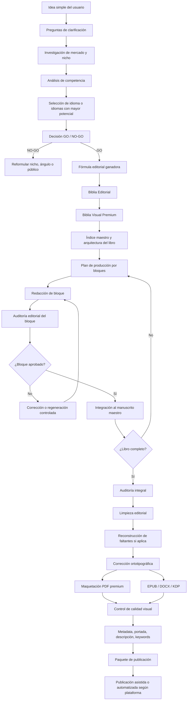

# 03_FLUJO_EDITORIAL_VALIDADO_RUNAS_A_CERVANTES.md

# Cervantes — Flujo editorial validado desde el proyecto Runas

**Proyecto:** Cervantes  
**Ruta sugerida:** `C:/Cervantes/docs/03_FLUJO_EDITORIAL_VALIDADO_RUNAS_A_CERVANTES.md`  
**Tipo de documento:** Investigación / diseño de flujo operativo  
**Estado:** Documento base para desarrollo del software  
**Versión:** 1.0  
**Fecha:** 2026-05-25  

---

## 1. Propósito del documento

Este documento traduce el flujo editorial validado durante el desarrollo del eBook **“Runas: El Lenguaje del Norte”** en una arquitectura funcional para el software **Cervantes**.

La conclusión principal del proyecto Runas es clara:

> Un eBook premium no nace de escribir muchas páginas de una vez. Nace de un proceso editorial completo: investigación, fórmula comercial, biblia editorial, diseño visual, redacción por bloques, auditoría, limpieza, ensamblaje, recuperación de faltantes, formatos finales y paquete de publicación.

Por lo tanto, Cervantes no debe construirse como un simple generador de texto. Debe construirse como una **plataforma editorial inteligente**, capaz de transformar una idea simple en un producto editorial completo, comercialmente competitivo, visualmente premium y listo para publicación asistida o automatizada según la plataforma.

---

## 2. Fuente de aprendizaje: qué demostró el proyecto Runas

El proyecto Runas validó varias decisiones editoriales importantes:

1. **El producto ganador no era solo un libro largo.**  
   La fórmula más sólida fue:  
   **eBook premium ilustrado + workbook/cuaderno práctico + guía rápida visual.**

2. **La autoridad editorial se construyó separando capas.**  
   En el caso de Runas se distinguió entre:
   - historia comprobable;
   - simbolismo interpretativo;
   - práctica contemporánea.

3. **La Biblia Editorial fue indispensable.**  
   Antes de redactar el manuscrito completo, se definieron:
   - identidad editorial;
   - promesa central;
   - tono;
   - estructura;
   - plantillas;
   - sistema visual;
   - reglas históricas, éticas y metodológicas;
   - reglas PDF, EPUB y KDP;
   - checklist de calidad.

4. **El manuscrito se desarrolló por bloques.**  
   Cada bloque fue redactado, aprobado, auditado y luego integrado.

5. **El ensamblaje final no fue trivial.**  
   Hubo que limpiar metatextos, eliminar prompts, quitar controles internos, corregir duplicaciones, recuperar faltantes y reconstruir secciones desde los mejores archivos disponibles.

6. **El diseño gráfico no puede quedar para el final.**  
   El proyecto necesitó notas de diseño, láminas, separadores, recuadros visuales, estilo de portada, sistema de paleta, tipografías, jerarquía editorial y recursos premium.

7. **El flujo debe incluir recuperación y control de daños.**  
   Durante el proyecto Runas aparecieron versiones parciales, archivos incompletos, entregas truncadas y ensamblajes incompletos. Cervantes debe contemplar esa realidad desde su arquitectura.

---

## 3. Principio central para Cervantes

Cervantes debe operar bajo este principio:

> Primero se diseña el producto editorial completo; luego se redacta; después se audita; finalmente se maqueta y prepara para publicar.

Esto implica que el software debe impedir que el usuario salte directamente desde una idea simple a un PDF final sin pasar por:

- investigación de mercado;
- validación de nicho;
- definición de idioma comercial;
- fórmula editorial;
- biblia editorial;
- diseño gráfico premium;
- estructura de capítulos;
- redacción por bloques;
- auditoría;
- ensamblaje;
- compliance;
- formatos;
- paquete comercial.

---

## 4. Diagrama general del flujo validado



---

## 5. Fases editoriales que Cervantes debe implementar

### Fase 0 — Creación del proyecto

Entrada mínima:

- idea simple del usuario;
- tipo de libro;
- objetivo comercial;
- público deseado;
- plataforma inicial preferida si existe;
- idioma base si el usuario lo conoce;
- autor, pseudónimo o marca editorial;
- nivel de automatización deseado.

Salida:

- proyecto creado;
- carpeta lógica interna;
- estado inicial: `IDEA_REGISTERED`.

---

### Fase 1 — Preguntas de clarificación

Cervantes no debe asumir demasiado. Antes de investigar o escribir, debe preguntar:

1. ¿El eBook será ficción, no ficción, espiritualidad, negocios, educación, salud, cocina, tecnología u otro nicho?
2. ¿El objetivo es vender en Amazon KDP, Gumroad, Shopify, Draft2Digital u otra plataforma?
3. ¿Debe ser PDF premium, EPUB, DOCX, paperback o bundle?
4. ¿El usuario quiere usar su nombre real, pseudónimo o marca editorial?
5. ¿El contenido será escrito con IA generativa, IA asistida o autoría humana con apoyo editorial?
6. ¿El libro necesita diseño visual avanzado?
7. ¿Debe incluir workbook, plantillas, guías rápidas o bonus?
8. ¿El software puede decidir los idiomas con mayor potencial comercial?
9. ¿El tema tiene riesgos legales, médicos, financieros, espirituales, religiosos o de derechos de autor?
10. ¿El usuario busca velocidad, calidad premium o equilibrio entre ambas?

Salida:

- briefing editorial;
- restricciones iniciales;
- dudas abiertas;
- estado: `BRIEFING_COMPLETED`.

---

### Fase 2 — Investigación de mercado

Cervantes debe investigar antes de escribir.

Debe analizar:

- tamaño del nicho;
- competencia directa;
- top sellers;
- precios;
- longitud habitual;
- estilo de portadas;
- tipo de promesa comercial;
- reseñas positivas y negativas;
- brechas no cubiertas;
- saturación;
- oportunidades de diferenciación;
- formato dominante;
- plataformas más convenientes;
- potencial de bundle;
- posibilidad de expansión a otros idiomas.

Salida:

- `MarketResearchReport`;
- matriz de competidores;
- puntuación de oportunidad;
- riesgos;
- estado: `MARKET_RESEARCH_COMPLETED`.

---

### Fase 3 — Selección de idiomas comerciales

Nuevo requisito incorporado:

> La aplicación debe ser capaz de determinar en qué idioma o idiomas el eBook tiene mayor probabilidad de éxito comercial.

Cervantes debe incluir un módulo llamado **Language Opportunity Engine**.

Este módulo debe evaluar:

- demanda del nicho por idioma;
- competencia por idioma;
- poder adquisitivo del mercado;
- plataformas disponibles por país;
- CPC aproximado si se piensa en anuncios;
- facilidad de posicionamiento orgánico;
- posibilidad de traducción/localización;
- disponibilidad de keywords;
- sensibilidad cultural del tema;
- riesgo de mala localización;
- necesidad de adaptación editorial, no solo traducción literal.

Ejemplo de salida:

```json
{
  "idioma_base_recomendado": "español neutro",
  "idiomas_secundarios_recomendados": ["inglés internacional"],
  "estrategia": "crear primero versión premium en español y luego localización editorial al inglés",
  "advertencia": "no traducir literalmente; adaptar título, subtítulo, keywords, ejemplos y tono comercial"
}
```

Estados posibles:

- `LANGUAGE_SELECTED`;
- `MULTILANGUAGE_RECOMMENDED`;
- `LOCALIZATION_REQUIRED`;
- `LANGUAGE_RISK_DETECTED`.

---

### Fase 4 — Decisión GO / NO-GO

Antes de producir el libro, Cervantes debe entregar una decisión:

## GO

El proyecto avanza si:

- hay demanda razonable;
- existe ángulo diferenciador;
- el tema permite promesa clara;
- el usuario puede competir con calidad;
- el formato es viable;
- el diseño visual puede elevar el valor percibido;
- no hay bloqueo legal grave;
- el precio objetivo tiene sentido.

## GO CONDICIONAL

Avanza con ajustes si:

- el nicho está saturado, pero hay ángulo premium;
- el idioma principal no es el más rentable, pero puede servir como MVP;
- el tema requiere disclaimers;
- la competencia es alta, pero el bundle puede diferenciarse;
- el diseño debe ser especialmente fuerte para competir.

## NO-GO

No avanza si:

- el nicho es demasiado débil;
- el tema implica riesgos legales altos;
- la promesa sería engañosa;
- no hay diferenciación;
- el coste de producción supera el potencial;
- la plataforma objetivo tiene restricciones incompatibles.

Salida:

- `GoNoGoReport`;
- recomendaciones;
- pivotes sugeridos;
- estado: `GO_APPROVED`, `GO_CONDITIONAL` o `NO_GO`.

---

### Fase 5 — Fórmula editorial ganadora

Inspirado en Runas, Cervantes debe decidir la fórmula más rentable. No debe asumir que el mejor producto es siempre un eBook largo.

Opciones:

1. eBook simple;
2. eBook premium ilustrado;
3. eBook + workbook;
4. eBook + guía rápida;
5. eBook + plantillas;
6. eBook + audio;
7. eBook + mini curso;
8. bundle completo;
9. serie de eBooks;
10. edición PDF premium + EPUB funcional.

La fórmula debe definir:

- extensión estimada;
- número de capítulos;
- nivel de diseño;
- cantidad de ilustraciones;
- cantidad de láminas;
- bonus;
- precio sugerido;
- plataforma principal;
- plataforma secundaria;
- estrategia de idioma;
- público objetivo;
- posicionamiento.

Salida:

- `EditorialFormula`;
- estado: `FORMULA_APPROVED`.

---

## 6. Biblia Editorial

La Biblia Editorial es obligatoria.

Debe incluir:

- título provisional;
- título recomendado;
- subtítulo;
- promesa central;
- lector ideal;
- tono;
- voz;
- autoridad del libro;
- límites éticos;
- disclaimers;
- índice maestro;
- capítulos;
- extensión por capítulo;
- estilo de escritura;
- estructura de cada capítulo;
- secciones fijas;
- ejercicios;
- tablas;
- recuadros;
- ejemplos;
- criterios de aceptación;
- checklist de calidad.

Cervantes debe bloquear la redacción del manuscrito hasta que exista una Biblia Editorial aprobada.

Estado:

- `EDITORIAL_BIBLE_DRAFTED`;
- `EDITORIAL_BIBLE_APPROVED`.

---

## 7. Biblia Visual Premium

Nuevo requisito reforzado:

> El diseño gráfico debe estar considerado dentro del proceso para asegurar que la calidad del eBook sea premium.

Por eso Cervantes debe crear una **Biblia Visual Premium** antes de maquetar.

Debe incluir:

### 7.1 Identidad visual

- estilo general;
- atmósfera;
- paleta;
- tipografías recomendadas;
- textura;
- tono visual;
- iconografía;
- estilo de portada;
- estilo de láminas;
- estilo de separadores.

### 7.2 Sistema de páginas

- portada;
- portada interna;
- página legal;
- índice;
- apertura de parte;
- apertura de capítulo;
- página de texto;
- página con imagen;
- doble página visual;
- recuadro destacado;
- tabla premium;
- ficha de consulta;
- workbook;
- bonus descargable.

### 7.3 Recursos visuales

- portada principal;
- mockup 3D;
- banners promocionales;
- imágenes de capítulos;
- separadores;
- íconos;
- láminas de resumen;
- tablas gráficas;
- plantillas del workbook;
- miniaturas para tienda;
- assets para redes sociales.

### 7.4 Prompts gráficos

Cada imagen o recurso debe tener:

- nombre del asset;
- objetivo;
- ubicación dentro del libro;
- prompt;
- negative prompt si aplica;
- relación de aspecto;
- tamaño recomendado;
- estilo;
- colores;
- nivel de detalle;
- restricciones;
- revisión humana requerida.

### 7.5 Checklist visual premium

Antes de exportar, el sistema debe revisar:

- coherencia de paleta;
- jerarquía tipográfica;
- márgenes;
- legibilidad;
- resolución de imágenes;
- consistencia de separadores;
- calidad de portada;
- contraste;
- alineación;
- ausencia de imágenes genéricas pobres;
- ausencia de errores visuales de IA;
- consistencia de estilo entre capítulos.

Estados:

- `VISUAL_BIBLE_DRAFTED`;
- `VISUAL_BIBLE_APPROVED`;
- `ASSETS_PENDING`;
- `ASSETS_APPROVED`;
- `VISUAL_QA_PASSED`.

---

## 8. Producción del manuscrito por bloques

La experiencia de Runas demostró que el manuscrito no debe generarse en una sola entrega.

Cervantes debe producir por bloques controlados.

Cada bloque debe tener:

- objetivo;
- contexto previo;
- capítulos incluidos;
- límites;
- restricciones;
- tono;
- extensión;
- checklist;
- salida esperada.

Ejemplo de bloque:

```text
BLOQUE 4:
Parte II — Capítulo 5
Objetivo: desarrollar el primer grupo temático.
No avanzar al capítulo siguiente.
Mantener tono definido por la Biblia Editorial.
Incluir notas de diseño útiles.
```

Estados:

- `BLOCK_PENDING`;
- `BLOCK_GENERATING`;
- `BLOCK_DRAFTED`;
- `BLOCK_AUDIT_PENDING`;
- `BLOCK_APPROVED`;
- `BLOCK_REJECTED`;
- `BLOCK_REQUIRES_REVISION`.

---

## 9. Auditoría por bloque

Cada bloque generado debe pasar por auditoría.

La auditoría debe revisar:

- coherencia con la Biblia Editorial;
- cumplimiento del índice;
- tono;
- calidad narrativa;
- profundidad;
- repeticiones;
- errores;
- contradicciones;
- contenido faltante;
- avance indebido hacia capítulos futuros;
- cumplimiento visual;
- notas de diseño;
- claims exagerados;
- problemas legales o de plataforma;
- consistencia del idioma;
- coherencia con el lector objetivo.

Resultado:

- aprobado;
- aprobado con correcciones menores;
- rechazado;
- requiere regeneración parcial;
- requiere revisión humana.

---

## 10. Ensamblaje maestro limpio

Cuando todos los bloques estén aprobados, Cervantes debe ensamblar el manuscrito completo.

Debe eliminar:

- prompts;
- aprobaciones;
- controles internos;
- frases tipo “desarrollo el bloque”;
- metatexto;
- comentarios de IA;
- duplicaciones;
- secciones huérfanas;
- placeholders no resueltos;
- pseudónimos pendientes;
- notas editoriales que no deban ir al lector.

Debe conservar:

- contenido final;
- notas de diseño útiles;
- estructura aprobada;
- bibliografía;
- conclusión;
- advertencias legales;
- índice;
- autor definitivo;
- año legal;
- coherencia visual.

Estado:

- `MASTER_MANUSCRIPT_ASSEMBLED`.

---

## 11. Motor de recuperación y reconstrucción

Runas demostró que el software debe contemplar errores reales del proceso:

- archivos incompletos;
- bloques truncados;
- versiones parciales;
- duplicaciones;
- entregas mezcladas con prompts;
- contenido aprobado repartido en varios archivos;
- ensamblajes incompletos.

Cervantes debe incluir un **Versioning and Recovery Engine**.

Funciones:

1. comparar versiones;
2. detectar faltantes;
3. identificar el archivo más completo;
4. recuperar secciones aprobadas;
5. fusionar contenido;
6. eliminar metatexto;
7. generar informe de diferencias;
8. conservar backup;
9. impedir declarar “final” un manuscrito incompleto;
10. registrar fuente de cada sección integrada.

Estados:

- `RECOVERY_REQUIRED`;
- `RECOVERY_IN_PROGRESS`;
- `SECTION_RECOVERED`;
- `MASTER_REBUILT`;
- `MASTER_NOT_YET_COMPLETE`.

---

## 12. Corrección editorial y ortotipográfica

Después del ensamblaje, Cervantes debe ejecutar:

- corrección ortográfica;
- corrección de puntuación;
- unificación de estilo;
- revisión de títulos;
- revisión de capitalización;
- revisión de cursivas;
- revisión de comillas;
- revisión de listas;
- revisión de notas de diseño;
- revisión de placeholders;
- revisión de nombres propios;
- revisión de términos técnicos;
- revisión de bibliografía;
- revisión de disclaimers.

Estado:

- `COPYEDITING_COMPLETED`.

---

## 13. Maquetación y diseño premium

Cervantes debe convertir el manuscrito en un producto visual.

El flujo debe contemplar:

1. selección de plantilla;
2. aplicación de paleta;
3. jerarquía tipográfica;
4. diseño de portada;
5. diseño de apertura de partes;
6. diseño de capítulos;
7. recuadros;
8. láminas;
9. tablas;
10. imágenes;
11. workbook;
12. guía rápida;
13. mockups;
14. exportación PDF;
15. exportación EPUB;
16. revisión de legibilidad.

El sistema debe distinguir entre:

- **PDF premium:** admite diseño visual fuerte, láminas, imágenes, recuadros y composición editorial.
- **EPUB:** debe priorizar reflujo, navegación, accesibilidad, limpieza semántica y compatibilidad.
- **DOCX:** útil para edición, Draft2Digital y flujos de revisión.
- **Paquete KDP:** portada, interior, metadata, keywords, descripción y checklist.

Estado:

- `LAYOUT_IN_PROGRESS`;
- `PDF_PREMIUM_READY`;
- `EPUB_READY`;
- `DOCX_READY`;
- `VISUAL_QA_PASSED`.

---

## 14. Metadata y paquete de venta

Cervantes debe generar:

- título;
- subtítulo;
- descripción larga;
- descripción corta;
- bullets comerciales;
- keywords;
- categorías;
- autor;
- bio;
- precio sugerido;
- estrategia de lanzamiento;
- texto para Gumroad;
- texto para Shopify;
- texto para KDP;
- texto para Draft2Digital;
- copy para redes;
- mockups;
- portada;
- sample preview;
- checklist de publicación.

Estado:

- `SALES_PACKAGE_READY`.

---

## 15. Publicación asistida o automatizada

Cervantes debe distinguir cuatro niveles:

### 15.1 Publicación automática real

Solo cuando:

- existe API oficial;
- los términos lo permiten;
- las credenciales están configuradas;
- el contenido pasó compliance;
- el usuario confirmó publicación.

### 15.2 Publicación semiautomática

El sistema prepara todo y automatiza partes seguras:

- creación de producto;
- subida de archivo;
- descripción;
- precio;
- imágenes;
- borrador.

Pero deja revisión final al usuario.

### 15.3 Paquete listo para publicar

El sistema entrega un ZIP con:

- PDF;
- EPUB;
- DOCX;
- portada;
- metadata;
- descripción;
- keywords;
- imágenes;
- checklist;
- instrucciones.

### 15.4 Guía manual paso a paso

Para plataformas donde no convenga automatizar:

- instrucciones;
- capturas recomendadas;
- checklist;
- campos a llenar;
- advertencias;
- verificación final.

Estado:

- `PUBLISHING_PACKAGE_READY`;
- `ASSISTED_PUBLICATION_READY`;
- `AUTO_PUBLICATION_READY`;
- `MANUAL_PUBLICATION_GUIDE_READY`.

---

## 16. Estados globales del pipeline

Cervantes debe tener estados claros:

```text
IDEA_REGISTERED
BRIEFING_COMPLETED
MARKET_RESEARCH_COMPLETED
LANGUAGE_SELECTED
GO_APPROVED
FORMULA_APPROVED
EDITORIAL_BIBLE_APPROVED
VISUAL_BIBLE_APPROVED
OUTLINE_APPROVED
BLOCKS_IN_PROGRESS
BLOCKS_COMPLETED
MASTER_MANUSCRIPT_ASSEMBLED
RECOVERY_REQUIRED
MASTER_REBUILT
COPYEDITING_COMPLETED
PDF_PREMIUM_READY
EPUB_READY
DOCX_READY
SALES_PACKAGE_READY
PUBLISHING_PACKAGE_READY
READY_FOR_HUMAN_APPROVAL
READY_FOR_PUBLICATION
```

---

## 17. Reglas de calidad heredadas del proyecto Runas

Cervantes debe aplicar estas reglas:

1. No generar libro final sin investigación previa.
2. No producir manuscrito sin Biblia Editorial.
3. No producir PDF premium sin Biblia Visual.
4. No asumir que más páginas significan más valor.
5. No inflar artificialmente el contenido.
6. No mezclar historia, símbolo y práctica sin advertencias.
7. No prometer resultados garantizados.
8. No tratar contenido IA como si fuera automáticamente publicable.
9. No publicar sin revisar políticas de plataforma.
10. No declarar un manuscrito “final” si tiene faltantes.
11. No eliminar notas de diseño útiles antes de la maquetación.
12. No automatizar plataformas sin permiso técnico y legal.
13. No traducir literalmente sin localización editorial.
14. No generar imágenes sin control visual.
15. No aprobar portada sin checklist gráfico premium.

---

## 18. Qué debe aprender Cervantes del error de ensamblaje parcial

Durante Runas se produjo una situación importante: un archivo fue llamado “manuscrito maestro final”, pero en realidad era un ensamblaje parcial con faltantes.

Cervantes debe evitar esto mediante:

- verificación de índice contra contenido real;
- conteo de capítulos;
- detección de placeholders;
- detección de secciones vacías;
- comparación con la Biblia Editorial;
- control de entregas aprobadas;
- reporte de completitud;
- bloqueo del estado “final” si faltan secciones.

El sistema debe usar etiquetas claras:

- `DRAFT`;
- `PARTIAL_ASSEMBLY`;
- `RECONSTRUCTED`;
- `COMPLETE_PENDING_QA`;
- `FINAL_APPROVED`;
- `READY_FOR_LAYOUT`.

---

## 19. Módulos de software derivados de este flujo

Cervantes debe implementar al menos estos módulos:

1. **Idea Intake Engine**
2. **Clarification Wizard**
3. **Market Research Engine**
4. **Language Opportunity Engine**
5. **Go/No-Go Decision Engine**
6. **Editorial Formula Engine**
7. **Editorial Bible Generator**
8. **Premium Visual Design Engine**
9. **Outline and Chapter Planner**
10. **Block Production Engine**
11. **Block Audit Engine**
12. **Master Assembly Engine**
13. **Versioning and Recovery Engine**
14. **Copyediting Engine**
15. **Format Builder**
16. **Visual QA Engine**
17. **Metadata Generator**
18. **Publishing Package Builder**
19. **Platform Connector Layer**
20. **Human Approval Gate**

---

## 20. Definición de terminado para este flujo

El flujo editorial de Cervantes se considera terminado cuando el sistema puede tomar una idea simple y producir:

- investigación de mercado;
- selección de idioma comercial;
- GO / NO-GO;
- fórmula editorial;
- Biblia Editorial;
- Biblia Visual Premium;
- índice maestro;
- manuscrito por bloques;
- auditorías por bloque;
- manuscrito maestro limpio;
- informe de completitud;
- recuperación de faltantes si aplica;
- PDF premium;
- EPUB;
- DOCX;
- portada;
- workbook o bonus si fue aprobado;
- metadata comercial;
- paquete listo para publicar;
- guía o integración de publicación según plataforma;
- checklist final;
- aprobación humana final.

---

## 21. Conclusión

El flujo validado por Runas demuestra que Cervantes debe funcionar como una **cadena editorial completa**, no como un generador rápido.

La ventaja competitiva de Cervantes será combinar:

- investigación comercial;
- inteligencia editorial;
- generación estructurada;
- diseño gráfico premium;
- control de calidad;
- compliance;
- recuperación de versiones;
- formatos profesionales;
- preparación comercial;
- publicación asistida.

La meta no es prometer best sellers garantizados.

La meta es producir eBooks con estructura, diseño, estrategia y calidad editorial suficientes para competir profesionalmente en el mercado digital.

